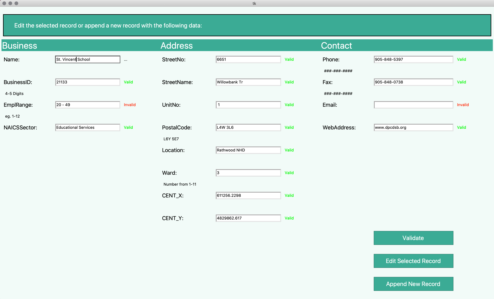

# MississaugaBusinessDirectoryManager

An MVC Application built using Python with Tkinter. 

Allows for the user to open a CSV file of Mississuga Businesses, select a specifc record and edit it's fields. 
Each field is valdiated with regex patterns and provides feedback regarding the validity of inputs. 

